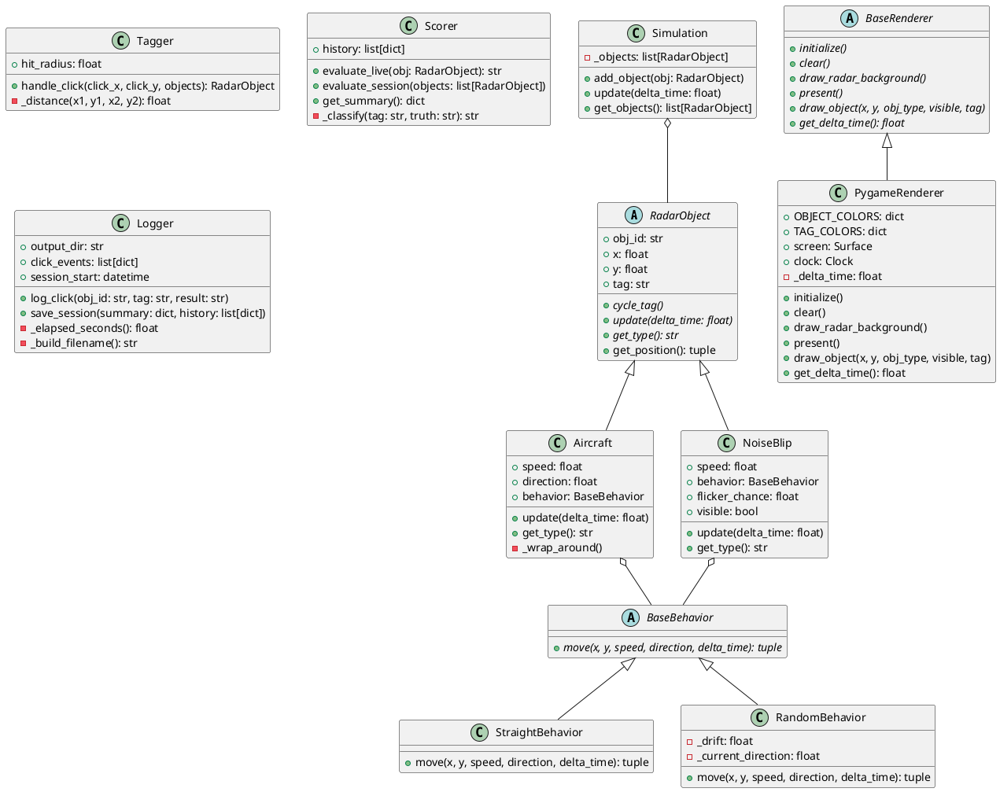
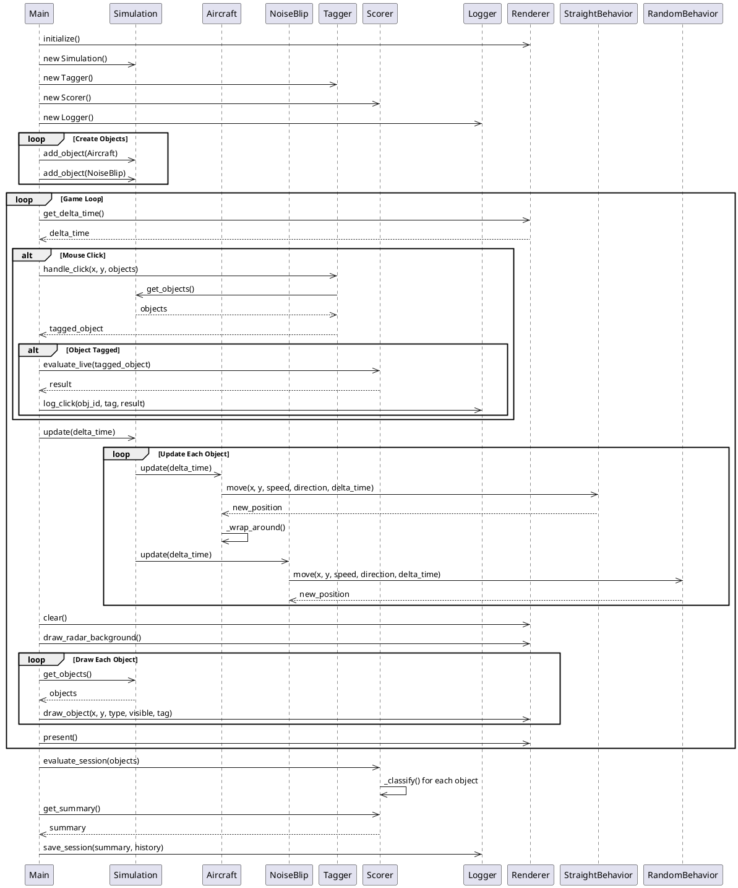

# Radar Tracking Simulation

A real-time radar tracking simulation built with Python and Pygame. Users can interact with radar blips by clicking to classify them as either real aircraft or noise signals. The system evaluates performance and logs all interactions for analysis.

## Features

- **Real-time Simulation**: Aircraft move with realistic physics and behaviors
- **Interactive Tagging**: Click radar blips to classify them as "real" or "noise"
- **Multiple Behaviors**: Straight-line flight and random erratic movement patterns
- **Performance Scoring**: Automatic evaluation of tagging accuracy
- **Session Logging**: Complete interaction history saved to JSON files
- **Extensible Architecture**: Plugin system for new behaviors and renderers

## Project Structure

```
radar_sim/
├── main.py                 # Application entry point
├── config.py              # Game constants and configuration
├── behaviors/             # Movement behavior system
│   ├── __init__.py
│   ├── base_behavior.py   # Abstract behavior interface
│   ├── straight_behavior.py # Straight-line movement
│   └── random_behavior.py # Erratic random movement
├── core/                  # Core simulation components
│   ├── __init__.py
│   ├── aircraft.py        # Real radar targets
│   ├── noise_blip.py      # False radar signals
│   ├── radar_object.py    # Abstract base for radar entities
│   ├── simulation.py      # Main simulation engine
│   ├── tagger.py          # Click handling and tagging logic
│   ├── scorer.py          # Performance evaluation system
│   └── logger.py          # Session logging and persistence
└── rendering/             # Display and rendering system
    ├── __init__.py
    ├── base_renderer.py   # Abstract renderer interface
    └── pygame_renderer.py # Pygame-based implementation
```

## Class Diagram



## Sequence Diagram



## Installation

1. **Clone the repository:**
   ```bash
   git clone <repository-url>
   cd RadarTrackingSimulation
   ```

2. **Create virtual environment:**
   ```bash
   python -m venv .venv
   ```

3. **Activate virtual environment:**
   - Windows: `.venv\Scripts\activate`
   - Linux/Mac: `source .venv/bin/activate`

4. **Install dependencies:**
   ```bash
   pip install -r requirements.txt
   ```

## Usage

1. **Run the simulation:**
   ```bash
   python radar_sim/main.py
   ```

2. **Game Controls:**
   - **Left Click**: Click on radar blips to cycle through tags (None → Real → Noise → None)
   - **Close Window**: Exit the simulation

3. **Visual Feedback:**
   - Green blips: Aircraft (real targets)
   - Red blips: Noise (false signals)
   - Cyan ring: Tagged as "real"
   - Orange ring: Tagged as "noise"
   - Flickering: Noise blips randomly appear/disappear

## Architecture Patterns

### Strategy Pattern (Behaviors)
Movement behaviors are interchangeable strategies that can be injected into radar objects:

```python
# Different behaviors for different objects
aircraft = Aircraft("AC001", 400, 300, 80, 45, StraightBehavior())
noise = NoiseBlip("N001", 300, 500, 40, RandomBehavior(drift_degrees=45))
```

### Abstract Factory (Renderers)
Multiple rendering backends can be swapped:

```python
# Could easily add OpenGLRenderer, TerminalRenderer, etc.
renderer = PygameRenderer()  # or WebGLRenderer(), etc.
```

### Observer Pattern (Logging/Scoring)
Multiple observers can watch and react to tagging events:

```python
# Logger and Scorer both observe the same events
logger.log_click(obj_id, tag, result)
scorer.evaluate_live(obj)
```

## Configuration

Edit `radar_sim/config.py` to customize:

- Window dimensions
- Radar radius
- Frame rate
- Colors

## Session Data

Each session creates a JSON file in the `sessions/` directory containing:

- Session metadata (start time, duration)
- Performance summary (true positives, false positives, etc.)
- Final object classifications
- Complete click history with timestamps

## Extending the System

### Adding New Behaviors
1. Create a new class inheriting from `BaseBehavior`
2. Implement the `move()` method
3. Use it when creating radar objects

### Adding New Object Types
1. Create a new class inheriting from `RadarObject`
2. Implement `update()` and `get_type()` methods
3. Add appropriate colors to the renderer

### Adding New Renderers
1. Create a new class inheriting from `BaseRenderer`
2. Implement all abstract methods
3. Update `main.py` to use the new renderer

## Dependencies

- **pygame**: Graphics and input handling
- **Python 3.8+**: Core language features

## License

[Add your license information here]